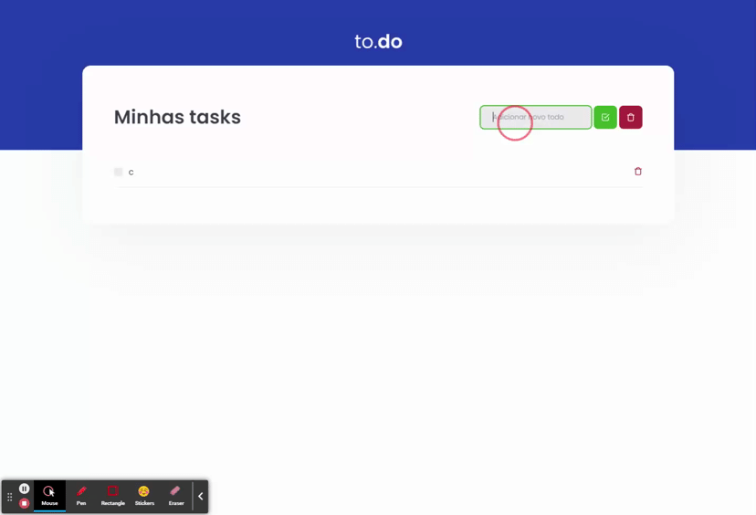

<h1 align="center">TaskList</h1>

## Sobre 
Esta é uma solução para o desafio de  'TaskList' do curso React JS da Rocketseat 

## ⚔ Desafio 

Você deve criar as funcionalidades para as três funções presentes nesse arquivo, que são:

- **handleCreateNewTask**: Deve ser possível adicionar uma nova task no estado de `tasks`, com os campos `id` que deve ser gerado de forma aleatória, `title` que deve ser um texto e `isComplete` que deve iniciar como false.
- **handleToggleTaskCompletion:** Deve alterar o status de `isComplete` para uma task com um ID específico que é recebido por parâmetro.
- **handleRemoveTask:** Deve receber um ID por parâmetro e remover a task que contém esse ID do estado.

## ➕ Funcionalidades Extras 

- Agora existe um botão que quando clicado remove todas as tarefas concluidas.
- Toda vez que adicionamos uma nova tarefa o input limpa 
- Ajustando o designer para verção mobile
- adicionando possibilidade de enviar a tafefa apertando o enter

## 👨‍🎓  Oque aprendi 
- Que dentro de um forEach, se queremos pular para o proximo objeto do array não podemos usar `continue` mas sim um `return` 